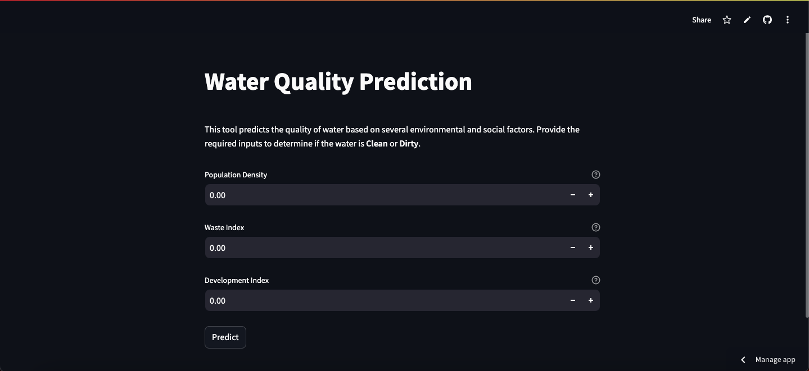
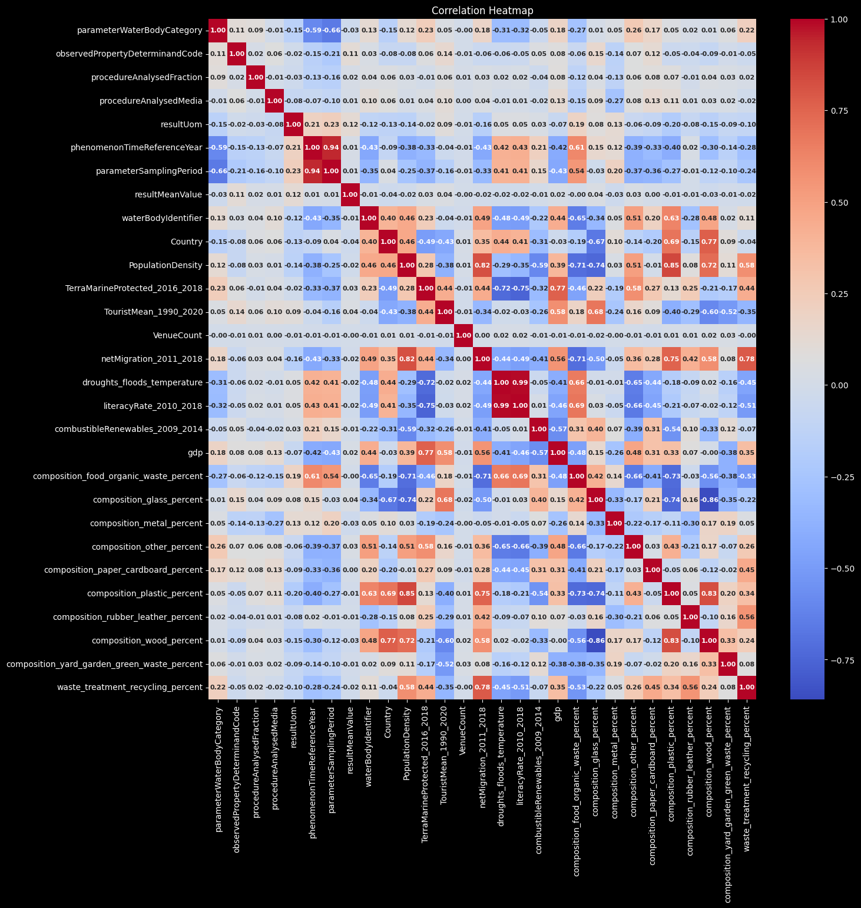
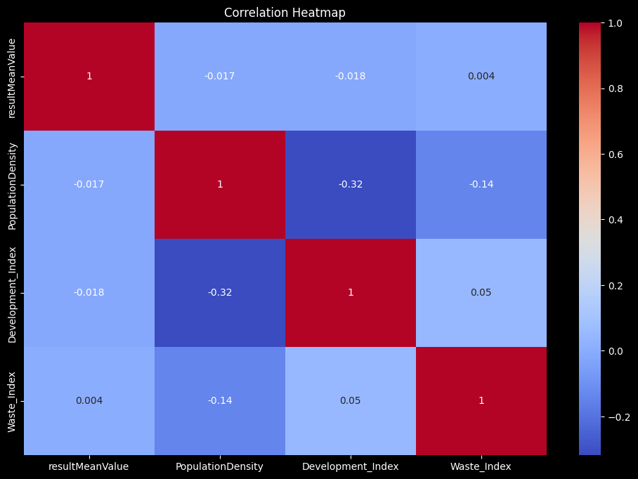
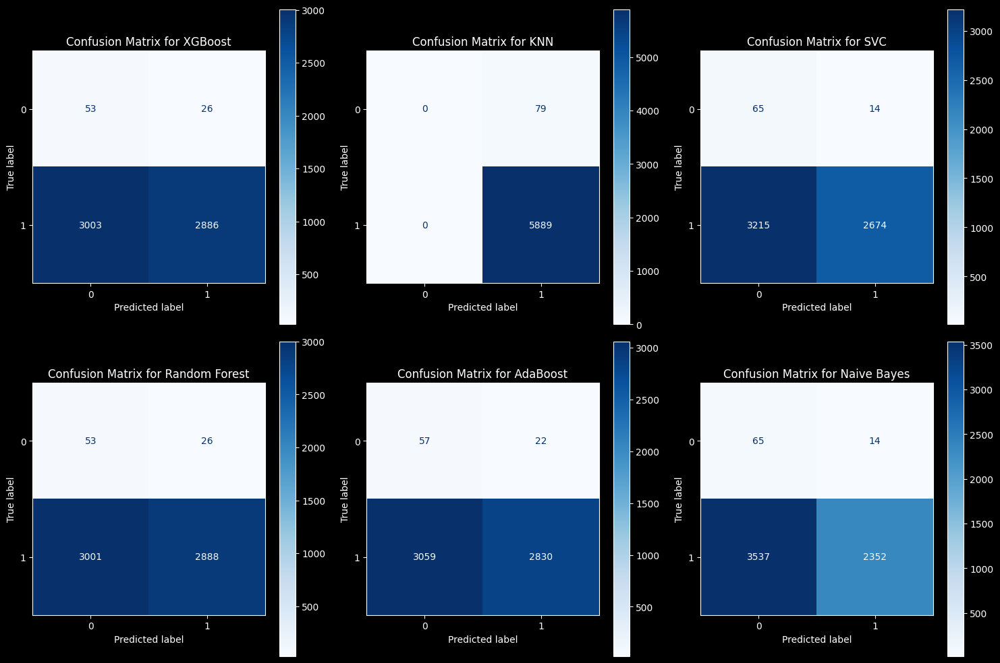
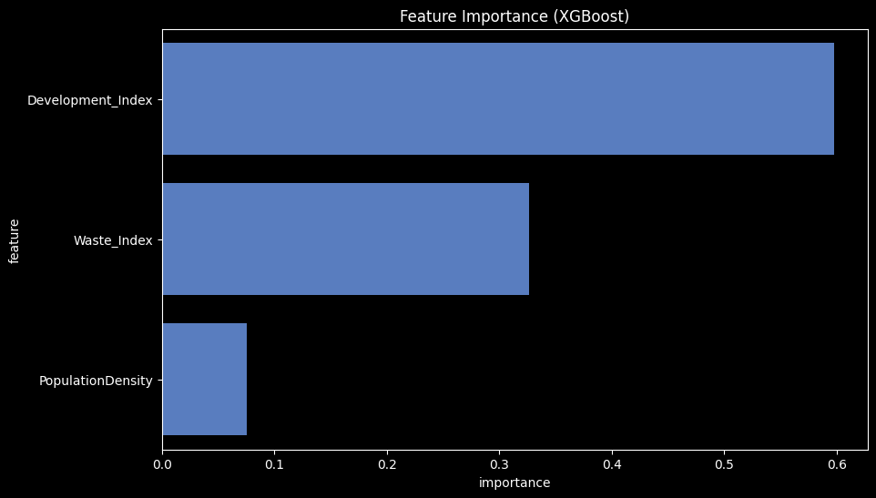
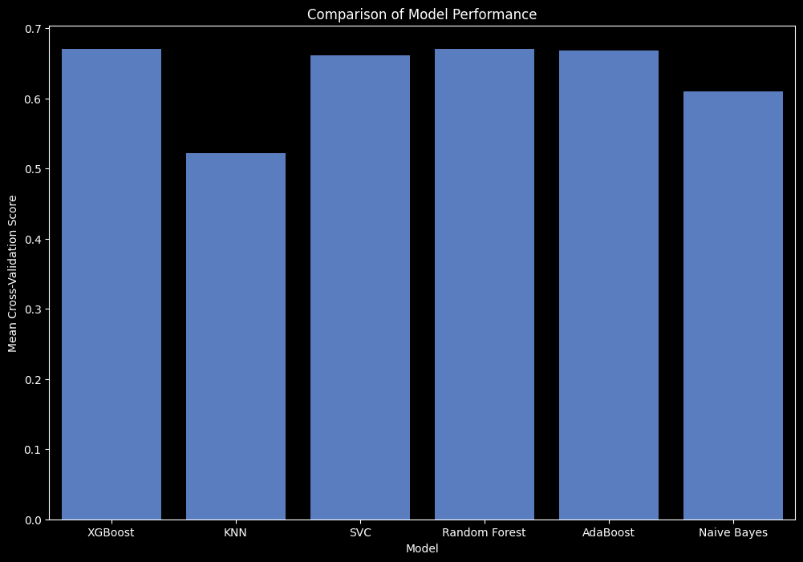
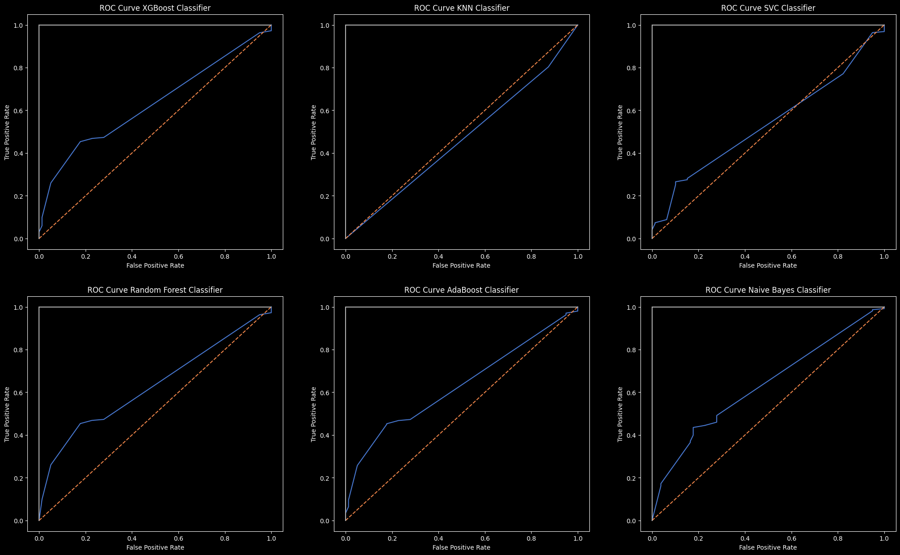

# Water-Quality-Analysis-ML

---

## Project Overview

This project aims to predict water quality using a dataset of various physicochemical, socio-economic, and environmental factors. By leveraging machine learning models, we classify water samples as **Clean** or **Dirty** based on their attributes. The final model is deployed using a **Streamlit-based web app**, providing an interactive UI for predictions.



**Deployed Application**: [Water Quality Analysis App](https://water-quality-analysis-ml.streamlit.app/)

## Dataset

- **Source:** [Kaggle - Water Quality Dataset](https://www.kaggle.com/datasets/ozgurdogan646/water-quality-dataset)
- **Description:** The dataset contains measurements such as population density, waste management indices, development index, and other features used to assess water quality.

## Goals

1. Explore the dataset and perform data visualization.
2. Preprocess the data by handling missing values, scaling features, and engineering new features:
3. Train machine learning models to predict water quality.
4. Evaluate and compare model performance.
5. Deploy the final model using a **Streamlit-based web app**.

### Features

- **Population Density**: Estimated as the number of people per unit area in a given region.
- **Waste Index**: A derived feature that measures waste composition against recycling rates.
- **Development Index**: Calculated using GDP and literacy rate, reflecting socio-economic factors affecting water quality.

#### Data Preprocessing

The preprocessing steps include:

1. Handling missing values and normalizing data where necessary.
2. Creating derived features such as the **Waste Index** and **Development Index** using formulas:

   $$
   Waste\ Index = \frac{(Max\ Waste\ Composition + Other\ Composition)}{Recycling\ Percentage}
   $$

<br>

$$
Development\ Index = \text{GDP} \times \text{Literacy Rate}
$$

3. Dropping unnecessary columns like 'Country', 'GDP', and 'TouristMean' to streamline the data.
4. Feature engineering to ensure all relevant attributes are used for training.

### Model

The final model used for prediction is an **XGBoost classifier**, which was selected after testing several models for accuracy and performance. The model was trained on the preprocessed dataset and evaluated using cross-validation.

<!--  -->

<br>
<p align='center'>







<br>
</p>
<br>

## Installation

1. Clone the repository:

   ```bash
   git clone https://github.com/Programming-Sai/Water-Quality-Analysis-ML.git
   cd Water-Quality-Analysis-ML
   ```

2. Set up a virtual environment:
   ```bash
   python -m venv venv
   source venv/bin/activate  # On Windows: venv\Scripts\activate
   ```
3. Install dependencies:
   ```bash
   pip install -r requirements.txt
   ```

## Folder Structure

```
water-quality-prediction/
│
├── data/
│   └── water_quality.csv        # The dataset
│
│
├── notebooks/
│   └── data_exploration.ipynb   # For data exploration and visualization
│   └── model_building.ipynb     # For training the model
|
├── deployment-ui/
│   ├── app.py                   # Streamlit app for deployment
│   └── assets/                  # Custom styles and images
|
│
├── requirements.txt             # Python dependencies
├── .gitignore                   # Python gitignore
└── README.md                    # Project overview
```

## Usage

1. Explore the dataset:
   - Open and run `notebooks/data_exploration.ipynb` to understand the data and visualize distributions.
2. Train the model:
   - Use `notebooks/model_building.ipynb` or `src/train.py` to train and evaluate the machine learning models.
3. Predict water quality:
   - Use `src/predict.py` to make predictions on new data.
4. Deploy the model:
   - Run the Streamlit app locally:
     ```bash
     streamlit run deployment-ui/app.py
     ```
   - Alternatively, use the deployed version: [Water Quality Analysis App](https://water-quality-analysis-ml.streamlit.app/).

## Key Libraries

- **pandas**: Data manipulation
- **numpy**: Numerical computations
- **scikit-learn**: Machine learning models
- **xgboost**: Gradient boosting for tabular data
- **matplotlib & seaborn**: Data visualization
- **Streamlit**: Model deployment and interactive UI

---

## Model Performance

Below are the performance metrics and comparison of models tested during development.

**Accuracy Comparison**  
(Insert image of accuracy comparison between different models here)

**Confusion Matrix for XGBoost**  
(Insert confusion matrix image for the final XGBoost model here)

---

## Contributors

- [Programming-Sai](https://github.com/Programming-Sai)
- [Pope-Addotey2004](https://github.com/Pope-Addotey2004)
- [BrytSnow](https://github.com/BrytSnow)

---

### **Steps to Set It Up**

1. Create a new repository on GitHub with the name `water-quality-prediction`.
2. Initialize your project folder locally and link it to the GitHub repo:
   ```bash
   git init
   git remote add origin https://github.com/Programming-Sai/Water-Quality-Analysis-ML.git
   git branch -M main
   git add .
   git commit -m "Initial commit"
   git push -u origin main
   ```

---

## Application Features

1. **Interactive UI**: Allows users to input values for Population Density, Waste Index, and Development Index.
2. **Tooltips for Guidance**: Each input field includes descriptions and formulas to assist users in understanding the required values.
3. **Real-Time Predictions**: Displays the prediction result (Clean or Dirty) with color-coded feedback.
