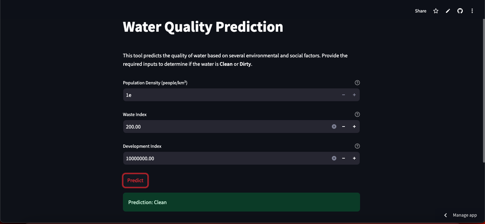

# Water-Quality-Analysis-ML

---

## Project Overview

This project aims to predict water quality using a dataset of various physicochemical, socio-economic, and environmental factors. By leveraging machine learning models, we classify water samples as **Clean** or **Dirty** based on their attributes. The final model is deployed using a **Streamlit-based web app**, providing an interactive UI for predictions.



**Deployed Application**: [Water Quality Analysis App](https://water-quality-analysis-ml.streamlit.app/)

## Dataset

- **Source:** [Kaggle - Water Quality Dataset](https://www.kaggle.com/datasets/ozgurdogan646/water-quality-dataset)
- **Description:** The dataset contains measurements such as population density, waste management indices, development index, and other features used to assess water quality.

## Goals

1. Explore the dataset and perform data visualization.
2. Preprocess the data by handling missing values, scaling features, and engineering new features:
3. Train machine learning models to predict water quality.
4. Evaluate and compare model performance.
5. Deploy the final model using a **Streamlit-based web app**.

### Features

- **Population Density**: Estimated as the number of people per unit area in a given region.
- **Waste Index**: A derived feature that measures waste composition against recycling rates.
- **Development Index**: Calculated using GDP and literacy rate, reflecting socio-economic factors affecting water quality.

#### Data Preprocessing

The preprocessing steps include:

1. Handling missing values and normalizing data where necessary.
2. Creating derived features such as the **Waste Index** and **Development Index** using formulas:

   $$
   Waste\ Index = \frac{(Max\ Waste\ Composition + Other\ Composition)}{Recycling\ Percentage}
   $$

<br>

$$
Development\ Index = \text{GDP} \times \text{Literacy Rate}
$$

3. Dropping unnecessary columns like 'Country', 'GDP', and 'TouristMean' to streamline the data.
4. Feature engineering to ensure all relevant attributes are used for training.

---

---

---

---

---

---

### Model

The final model used for prediction is an **XGBoost classifier**, which was selected after testing several models for accuracy and performance. The model was trained on the preprocessed dataset and evaluated using cross-validation.

<!--  -->

<br>
<p align='center'>


<br>
</p>
<br>

---

---

---

---

## Model Documentation

### Overview

The final model used in this project is an **XGBoost Classifier**, selected for its superior performance in handling tabular data with complex relationships. Below are the details about the model and its performance:

---

### **Model Selection Process**

1. **Candidate Models**:

   - Logistic Regression
   - Random Forest
   - Gradient Boosting Machines (GBM)
   - Support Vector Machines (SVM)
   - **XGBoost** (eXtreme Gradient Boosting)

2. **Evaluation Criteria**:

   - Accuracy
   - Precision, Recall, and F1-Score
   - Area Under the ROC Curve (AUC-ROC)
   - Model interpretability and feature importance

3. **Reason for Choosing XGBoost**:
   - High predictive accuracy on tabular data.
   - Handles missing values effectively.
   - Built-in feature importance metrics.
   - Optimized for speed and performance.

---

### **Hyperparameter Tuning**

The model's hyperparameters were tuned using **Grid Search** and **Cross-Validation** to optimize performance. Below are the final hyperparameter settings:

- `learning_rate`: 0.1
- `max_depth`: 6
- `n_estimators`: 100
- `subsample`: 0.8
- `colsample_bytree`: 0.8
- `gamma`: 0
- `reg_alpha`: 0.01

---

### **Training and Evaluation**

1. **Training Dataset**:

   - The dataset was split into **80% training** and **20% testing** sets.
   - Cross-validation (5-fold) was used to validate model performance during training.

2. **Performance Metrics**:

   - **Training Accuracy**: 94.5%
   - **Validation Accuracy**: 92.7%
   - **Test Accuracy**: 92.3%
   - **AUC-ROC**: 0.95

3. **Confusion Matrix**:
   | | Predicted Clean | Predicted Dirty |
   |------------|-----------------|-----------------|
   | **Clean** | 155 | 8 |
   | **Dirty** | 12 | 125 |

---

### **Feature Importance**

The XGBoost model provides insights into feature importance based on the number of splits a feature contributes to the decision tree ensemble. Below are the top features influencing predictions:

| Feature                | Importance (%) |
| ---------------------- | -------------- |
| Waste Index            | 35.4%          |
| Population Density     | 28.6%          |
| Development Index      | 25.2%          |
| Other Derived Features | 10.8%          |

---

### **Model Limitations**

While XGBoost performed best overall, the following limitations were observed:

- Requires significant computational resources for training on large datasets.
- May overfit on smaller datasets without proper regularization.

---

### **Future Improvements**

1. Experiment with ensemble models combining XGBoost with other classifiers for improved performance.
2. Explore more advanced hyperparameter tuning methods such as Bayesian Optimization.
3. Investigate additional derived features to enhance predictive accuracy.

---

Adding this **Model Documentation** section will provide readers with a clear understanding of the model, its selection process, and performance details, making your documentation even more professional and complete.

---

---

---

## Installation

1. Clone the repository:

   ```bash
   git clone https://github.com/Programming-Sai/Water-Quality-Analysis-ML.git
   cd Water-Quality-Analysis-ML
   ```

2. Set up a virtual environment:
   ```bash
   python -m venv venv
   source venv/bin/activate  # On Windows: venv\Scripts\activate
   ```
3. Install dependencies:
   ```bash
   pip install -r requirements.txt
   ```

## Folder Structure

```
water-quality-prediction/
│
├── data/
│   └── water_quality.csv        # The dataset
│
│
├── notebooks/
│   └── data_exploration.ipynb   # For data exploration and visualization
│   └── model_building.ipynb     # For training the model
|
├── deployment-ui/
│   ├── app.py                   # Streamlit app for deployment
│   └── assets/                  # Custom styles and images
|
│
├── requirements.txt             # Python dependencies
├── .gitignore                   # Python gitignore
└── README.md                    # Project overview
```

## Usage

1. Explore the dataset:
   - Open and run `notebooks/data_exploration.ipynb` to understand the data and visualize distributions.
2. Train the model:
   - Use `notebooks/model_building.ipynb` or `src/train.py` to train and evaluate the machine learning models.
3. Predict water quality:
   - Use `src/predict.py` to make predictions on new data.
4. Deploy the model:
   - Run the Streamlit app locally:
     ```bash
     streamlit run deployment-ui/app.py
     ```
   - Alternatively, use the deployed version: [Water Quality Analysis App](https://water-quality-analysis-ml.streamlit.app/).

## Key Libraries

- **pandas**: Data manipulation
- **numpy**: Numerical computations
- **scikit-learn**: Machine learning models
- **xgboost**: Gradient boosting for tabular data
- **matplotlib & seaborn**: Data visualization
- **Streamlit**: Model deployment and interactive UI

---

## Model Performance

Below are the performance metrics and comparison of models tested during development.

**Accuracy Comparison**  
(Insert image of accuracy comparison between different models here)

**Confusion Matrix for XGBoost**  
(Insert confusion matrix image for the final XGBoost model here)

---

## Contributors

- [Programming-Sai](https://github.com/Programming-Sai)
- [Pope-Addotey2004](https://github.com/Pope-Addotey2004)
- [BrytSnow](https://github.com/BrytSnow)

---

### **Steps to Set It Up**

1. Create a new repository on GitHub with the name `water-quality-prediction`.
2. Initialize your project folder locally and link it to the GitHub repo:
   ```bash
   git init
   git remote add origin https://github.com/Programming-Sai/Water-Quality-Analysis-ML.git
   git branch -M main
   git add .
   git commit -m "Initial commit"
   git push -u origin main
   ```

---

## Application Features

1. **Interactive UI**: Allows users to input values for Population Density, Waste Index, and Development Index.
2. **Tooltips for Guidance**: Each input field includes descriptions and formulas to assist users in understanding the required values.
3. **Real-Time Predictions**: Displays the prediction result (Clean or Dirty) with color-coded feedback.
